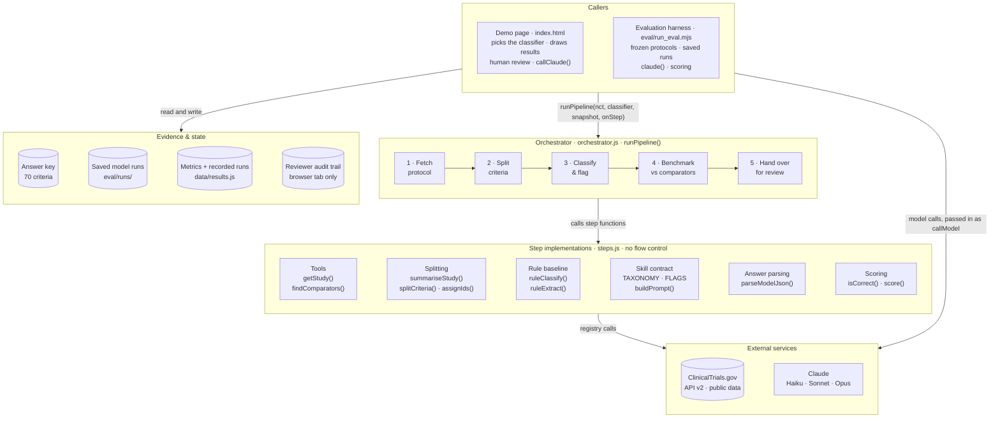
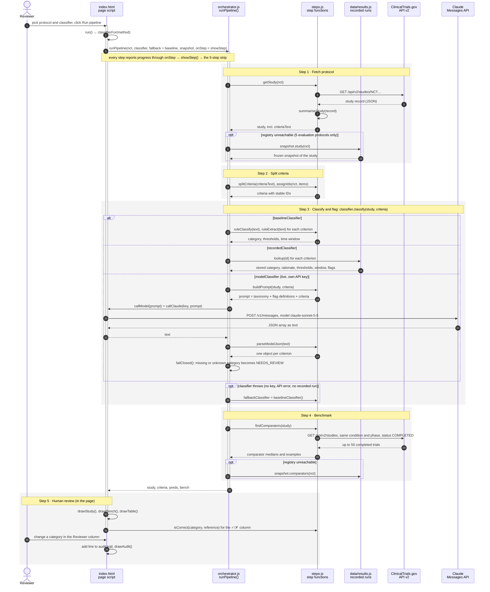
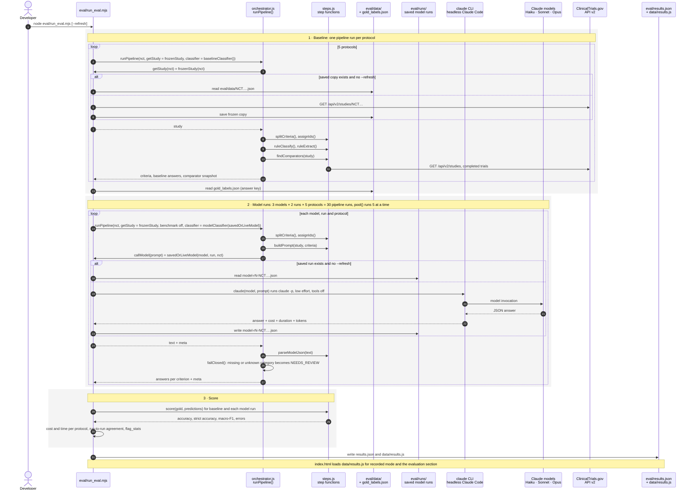

# Protocol Eligibility Copilot

**Live demo:** https://lorenzopolidori.github.io/protocol-eligibility-copilot/

A one-day prototype of an agentic-AI skill for clinical **Development Operations**. It takes a
protocol from ClinicalTrials.gov and turns its eligibility criteria into structured, reviewable
data. Each criterion gets a category, its thresholds and washout windows, and feasibility flags
for a reviewer. It then benchmarks the protocol against completed trials in the same indication
and phase. It is evaluated against a rule-based baseline on quality, cost, latency and
run-to-run consistency.

Uses only public registry data and makes no eligibility decision about any patient. Not affiliated with or endorsed by GSK.

## Background

### Clinical trials

Before a new medicine or vaccine can be approved, a drug company (the
*sponsor*) tests it on volunteers in clinical trials. A Phase 3 trial is the large, final stage,
often with hundreds or thousands of participants at dozens of hospitals (*sites*) in many
countries. It usually takes years and costs a great deal.

### The protocol

Each trial follows a written rulebook called the protocol. It covers what is
being tested, on whom, how and for how long. Sponsors publish a summary of every protocol on
[ClinicalTrials.gov](https://clinicaltrials.gov), the public US registry used worldwide. This
tool reads from it.

### Eligibility criteria

One part of the protocol sets out who may take part. *Inclusion
criteria* are what a volunteer must have, and *exclusion criteria* are what rules them out. A
trial typically has 10 to 40 of them, written in dense medical language. Every
extra restriction shrinks the pool of patients who qualify. That slows recruitment, raises the
share of candidates who are screened and then turned away, and often forces costly protocol
changes (*amendments*) later.

## The AI agent 

The AI agent in this repository turns one block of medical text for each criterion into a structured
row that a person can scan, sort and question. Examples from GSK protocols in this demo:

| Criterion (from the protocol) | Category | Threshold | Washout / time window | Flag for the reviewer |
|---|---|---|---|---|
| "Body mass index (BMI) ≥16 kg/m²" | Demographics | BMI ≥ 16 | none | modernisation candidate |
| "Treatment with an HIV-1 immunotherapeutic vaccine within 90 days of screening" | Prior therapy | none | 90 days before screening | washout |
| "Known active infectious diseases … or known HIV" | Comorbidity & safety | none | none | ambiguous; modernisation candidate |
| "Participants who, in the opinion of the investigator, can and will comply with the protocol…" | Consent & logistics | none | none | investigator judgement |

- **Category:** what kind of rule it is, such as age or weight, the disease itself, past
  treatments, lab results, other illnesses, pregnancy, or consent. Grouping shows at a glance where
  a protocol is most restrictive.
- **Threshold:** the number that decides eligibility, such as a BMI of at least 16 or a lung
  function reading below 70%.
- **Washout window:** how long a volunteer must wait after a previous treatment before joining,
  such as 90 days. Long washouts delay or block enrolment.
- **Feasibility flags:** prompts for a human to look again. Examples: a rule that adds screening
  work, relies on a doctor's judgement, is worded ambiguously, or is the kind of exclusion that US
  regulators (FDA) and oncology groups now encourage sponsors to relax unless it is scientifically
  needed, such as blanket exclusion of people with HIV.

**Feasibility and the benchmark.** *Feasibility* asks whether a trial can realistically recruit
the patients it needs, on time and at the planned sites. To give context, the tool finds completed
trials of the same disease and phase on ClinicalTrials.gov and compares the protocol against their
typical (median) figures: number of criteria, participants, sites and duration. For example, the
depemokimab COPD trial plans 1,196 participants, against a median of about 330 in comparable
completed COPD Phase 3 trials. That gap is a useful question to ask early.

**The reviewer.** The output is a draft for a person on the study team, such as a feasibility or
clinical operations lead. They check every row, correct anything wrong, and every change is logged.
The tool never decides whether any patient is eligible, and it only uses public registry text.

## The goal

Give study teams a fast, consistent first pass that challenges eligibility criteria
at the design stage, before sites see the protocol. That is the cheapest point to remove
unnecessary restrictions, and it should mean faster recruitment and fewer amendments. The wider aim
is to show a repeatable way to bring agentic AI into a regulated workflow:

1. Pick one real workflow.
2. Measure a simple baseline.
3. Build the AI step against a fixed contract.
4. Prove it beats the baseline on quality, cost, speed and consistency.
5. Keep a human accountable for every output.

## Evaluation - how we know it works

To evaluate the performance of the AI agent we use an evaluation harness. We can think of it as an exam with an answer key.

1. **The answer key.** Before any AI was run, each of the 70 criteria from the 5 protocols was
   given its correct category by hand. A few criteria genuinely fit two categories, and for
   those a second answer is also accepted.
2. **Two candidates take the exam:**
   - **The baseline:** a simple program that matches keywords. If it sees "vaccine" it answers
     *Prior therapy*; if it sees "history of" or "disease" it answers *Comorbidity*. It stands in
     for the quick tool a team might build first. It was written before the AI was tested and
     never adjusted to fit the answer key.
   - **The AI:** Claude, given the same criteria and the written category definitions.
3. **Marking.** Each answer is compared with the key.

Real examples where the two disagreed:

| Criterion (trial) | Answer key | Keyword baseline | Claude Sonnet |
|---|---|---|---|
| "History of hypersensitivity or allergic reaction to any previous influenza vaccine" (flu vaccine) | Comorbidity & safety: it is an allergy | ✗ Prior therapy, because it saw "vaccine" | ✓ Comorbidity & safety |
| "HIV-1 RNA <50 copies/mL at screening" (HIV treatment) | Disease: viral load measures the disease being studied | ✗ Comorbidity, because it saw "HIV" | ✓ Disease |
| "Moderate to severe COPD, defined as a clinically documented history of COPD…" (COPD) | Disease: it defines the condition under study | ✗ Comorbidity, because it saw "history of" | ✓ Disease |

The baseline matches words, while the AI reads context. For example, HIV is *the disease
under study* in an HIV trial but *another illness* in a lung cancer trial.

**The scores.**
- *Strict* counts only exact matches with the main answer: baseline 50 of 70 (71%), Claude
  Sonnet 65 of 70 (93%).
- *Lenient* also accepts the reasonable second answer: baseline 54 of 70 (77%), Sonnet 70 of 70
  (100%).
- All five of Sonnet's strict misses were criteria with two valid answers where it picked the
  other one. For example, "chronic hypercapnia requiring non-invasive ventilation" is *Disease*
  in the key, because it describes how severe the COPD is. Sonnet chose *Prior therapy*, because
  ventilation is a treatment. Both are defensible.

**Is it practical to use?** Accuracy is not enough on its own, so the report also measures:
- **Cost:** about $0.03 to process a whole protocol with Sonnet, at list price.
- **Speed:** about 9 seconds per protocol.
- **Consistency:** each protocol was run twice. Sonnet gave identical answers both times for all
  70 criteria; Haiku did for 96% and Opus for 99%. A reviewer should not get a different answer
  on Tuesday than on Monday.
- **Reliability:** every answer came back in the expected format. A malformed answer would be
  marked "needs review", never guessed.

**Bottom line.** The AI clearly beats the simple tool, and it is cheap and fast. But the answer
key is small and was drafted with AI help. The next steps are a larger key labelled by clinical
operations experts, and measuring how much reviewer time the tool actually saves.

**What about the flags?** The category is only half of the output. For each criterion the AI
also decides whether to raise flags that ask a reviewer to look again: *washout*, *investigator
judgement*, *screening burden*, *ambiguous* and *modernisation candidate*.

We don't yet know whether the flags are right. The category has an answer
key. The flags don't, because "does this criterion deserve a second look?" is a judgement call
that needs clinical operations experts to answer.

**What we can measure now is consistency.** It is a necessary condition, not proof of
correctness. If the AI agent raises a flag on one run and not the next, or two models disagree about
the same criterion, that flag can't be trusted yet. Results across the 70 criteria:

| Flag | What it means | Raised by Sonnet | Sonnet repeats itself on a second run | Sonnet and Opus agree* |
|---|---|---|---|---|
| Washout | A waiting period after a previous treatment | 12 of 70 | 97% | 69% |
| Investigator judgement | Relies on the site doctor's opinion | 19 of 70 | 97% | 95% |
| Screening burden | Adds tests or paperwork at screening | 21 of 70 | 87% | 53% |
| Ambiguous | Wording likely to cause questions from sites | **41 of 70** | 86% | 67% |
| Modernisation candidate | An exclusion that FDA/ASCO guidance suggests relaxing | 21 of 70 | 83% | **22%** |

\* Agreement means: of all criteria where either model raised the flag, the share where both did.

What this tells us:
- **Two flags look dependable.** *Washout* and *investigator judgement* are close to factual
  questions: is there a time limit, and does the text say "in the opinion of the investigator"?
  They are stable and the models agree. Every washout flag also came with an extracted time window
  (12 of 12).
- **"Ambiguous" is raised too often.** It appears on 59% of criteria. A flag on most rows stops
  being useful, because reviewers learn to ignore it.
- **"Modernisation candidate" is unstable.** Sonnet raised it 21 times and Opus 12, and they agreed
  on only 6. Some are sensible: both flagged a lung-cancer trial's blanket exclusion of people with
  HIV, which current guidance discourages. Others are doubtful: Sonnet flagged a minimum BMI of 16,
  which is not one of the exclusion types the guidance names. The definition is too loose.
- **Overall,** Sonnet's full set of flags was identical across its two runs for only 61% of
  criteria, against 100% for the category. The flags are the least mature part of the tool, and
  the demo treats them as prompts for a human, never as decisions.

**How we would find out properly:**
1. **Tighten the definitions.** For example, limit *modernisation candidate* to the exclusion types
   the guidance actually lists, and require a one-line reason for every flag.
2. **Build an answer key for flags.** Two clinical operations reviewers label the same criteria
   independently. Check first that they agree with each other; if experts disagree, the flag
   itself needs redefining.
3. **Score the AI on two questions.** Of the flags it raises, how many do experts agree with? That
   measures crying wolf. Of the criteria experts would flag, how many did it catch? That measures
   missed issues.
4. **Keep measuring in a pilot.** Extend the audit trail to record whether reviewers accept or
   dismiss each flag. That gives a running, real-world score.

The consistency figures are produced by `eval/run_eval.mjs` (`flag_stats` in `eval/results.json`).

## Architecture

A constrained workflow, not a free-roaming agent. The code is split into three layers:

- **`steps.js`: the step implementations.** Small functions with no flow control: the two
  registry tools, the splitter, the rule baseline, the prompt builder, the answer parser and the
  scorer.
- **`orchestrator.js`: the flow.** `runPipeline()` runs the steps in a fixed order, picks the
  classifier, applies the fallbacks and fails closed on bad answers. The model is called at one
  step only, against a fixed contract: a taxonomy, an output schema and stable criterion IDs.
- **The callers.** The demo page (`index.html`) and the evaluation harness (`eval/run_eval.mjs`)
  both call the same `runPipeline()`, so what is evaluated is exactly what the page runs. Each
  caller supplies only what differs: where the protocol comes from, which classifier to use, how
  to reach the model, and what to do with the results.



| Block | Role | Agentic concern it addresses |
|---|---|---|
| `runPipeline()` in `orchestrator.js` | Runs fetch → split → classify → benchmark → hand-over in a fixed order, with a fallback at every step; reports progress through `onStep` | Orchestration, reliability |
| Classifiers in `orchestrator.js` | `baselineClassifier`, `recordedClassifier` and `modelClassifier`: interchangeable ways to do step 3 | Orchestration |
| `getStudy()`, `findComparators()` in `steps.js` | Deterministic tools over the public registry, testable like ordinary code | Tool use |
| Splitter + contract in `steps.js` | One protocol per call, stable IDs, taxonomy definitions in the prompt, no patient data | Context |
| `failClosed()` in `orchestrator.js` | A malformed or missing answer becomes `NEEDS_REVIEW`, never a silent default | Reliability |
| Stateless calls | Nothing carries between protocols. The only stored data are the frozen protocols and saved model runs; the reviewer audit trail lives in the browser tab | Memory |
| Eval harness + `score()` | Baseline vs models on accuracy, cost, latency and run-to-run agreement; one command to re-run | Evaluation |
| `tests/orchestrator.test.mjs` | Checks every step, fallback and classifier path offline | Reliability |
| `SKILL.md` | The classification step packaged as a reusable skill with its standards | Skills library |

## How the code runs: sequence diagrams

Both callers run the same pipeline, `runPipeline()` in `orchestrator.js`, which calls the step
functions in `steps.js`:

- **A run on the demo page:** `index.html` picks the classifier, calls `runPipeline()`, shows
  progress and results, and handles the human review.
- **The offline evaluation:** `eval/run_eval.mjs` calls `runPipeline()` once per protocol with the
  baseline and 30 times with the models, then scores the results and writes the files the page
  displays.

Read each diagram top to bottom. Solid arrows are calls; dashed arrows are what comes back.
`alt` boxes are alternatives (only one branch runs), `opt` boxes run only when their condition
is true, and `loop` boxes repeat. When the orchestrator calls back into a caller (for example
`callModel`), that is a function the caller passed in.

### A. One run on the demo page



### B. The offline evaluation (`node eval/run_eval.mjs`)



### Where each function lives

| Function | File | What it does |
|---|---|---|
| `runPipeline()` | `orchestrator.js` | **The orchestrator:** runs the 5 steps in order, with the fallbacks |
| `baselineClassifier()`, `recordedClassifier()`, `modelClassifier()` | `orchestrator.js` | The three interchangeable classifiers for step 3 |
| `failClosed()` | `orchestrator.js` | Turns missing or unknown categories into NEEDS_REVIEW |
| `getStudy()` | `steps.js` | **Tool:** fetches one protocol from ClinicalTrials.gov |
| `findComparators()` | `steps.js` | **Tool:** searches completed trials with the same condition and phase, and computes medians |
| `summariseStudy()` | `steps.js` | Picks the fields we need out of a ClinicalTrials.gov record |
| `splitCriteria()`, `assignIds()` | `steps.js` | Split the eligibility text into individual criteria and give each a stable ID |
| `ruleClassify()`, `ruleExtract()` | `steps.js` | The keyword baseline: category, thresholds and time window |
| `buildPrompt()` | `steps.js` | Builds the model prompt from the taxonomy, flag definitions and criteria |
| `parseModelJson()` | `steps.js` | Pulls the JSON answer out of the model's text |
| `isCorrect()`, `score()` | `steps.js` | Compare answers with the answer key; compute accuracy and macro-F1 |
| `median()`, `monthsBetween()` | `steps.js` | Small helpers for the benchmark |
| `run()`, `classifierFor()` | `index.html` | Start a run: choose the classifier and the snapshot, call `runPipeline()`, draw the results |
| `showStep()`, `setStep()`, `drawTrace()` | `index.html` | Turn progress events into the 5-step strip |
| `callClaude()` | `index.html` | Live mode: the page's `callModel`, one call to the Claude Messages API with your key |
| `drawStudy()`, `drawBench()`, `drawTable()`, `drawAudit()` | `index.html` | Render the study facts, benchmark, criteria table and audit trail |
| `frozenStudy()` | `eval/run_eval.mjs` | The harness's `getStudy`: reads the frozen protocol from `eval/data/` |
| `savedOrLiveModel()` | `eval/run_eval.mjs` | The harness's `callModel`: reuses a saved run or calls the model and saves it |
| `claude()` | `eval/run_eval.mjs` | Runs `claude -p` (headless Claude Code) for one model call |
| `pool()` | `eval/run_eval.mjs` | Runs up to 5 pipeline runs in parallel |

## Results (5 GSK/ViiV Phase 3 protocols, 70 criteria, 2 runs per model, low effort)

| Method | Accuracy (lenient) | Accuracy (strict) | Cost / protocol* | Time / protocol | Run agreement |
|---|---|---|---|---|---|
| Rule baseline (keywords) | 77.1% | 71.4% | $0 | <1 ms | n/a |
| Claude Haiku 4.5 | 100% | 92.1% | $0.041 | 62.9 s | 95.7% |
| **Claude Sonnet 5.5** | **100%** | **92.9%** | **$0.027** | **8.6 s** | **100%** |
| Claude Opus 5.5 | 100% | 93.6% | $0.052 | 11.8 s | 98.6% |

\* List price through headless Claude Code's harness, so an upper bound on a direct API call.
Lenient accuracy accepts a second defensible label for compound criteria; strict uses the
primary label only. The category task saturates, so the decision comes down to cost, latency and
consistency. The next evaluation round should score the flags and thresholds against labels from
clinical operations reviewers.

## Layout

```
index.html                 the demo page: UI only (static; no build step)
orchestrator.js            the flow: runPipeline(), the classifiers, fallbacks, fail-closed check
steps.js                   the step implementations: tools, splitter, baseline, taxonomy,
                           prompt, parser, scorer (no flow control)
data/results.js            evaluation output consumed by the page
skills/eligibility-criteria-structurer/SKILL.md   the step packaged as a reusable agent skill
tests/orchestrator.test.mjs   offline tests of every pipeline path
eval/run_eval.mjs          evaluation harness: runs runPipeline() and scores the results
eval/gold_labels.json      reference labels (pilot set; see caveats)
eval/data/*.json           frozen ClinicalTrials.gov records used for evaluation
eval/runs/*.json           raw model outputs with cost, latency and token usage
```

## Recorded vs live: what gets saved

**The evaluation results are static, captured once.** All 30 model runs (3 models × 2 runs × 5
protocols) were made on 1 Oct 2026 by running `eval/run_eval.mjs` locally. They were committed to
this repo by hand, one JSON file per call in `eval/runs/`, holding the model's raw answer, cost,
time and token counts. No automation adds or changes them: there is no CI job, schedule or bot.

**The demo page never saves anything.** It is a static site on GitHub Pages, so it can read files
from this repo but cannot write to it.

| Classifier on the page | What happens | Saved? |
|---|---|---|
| Rule baseline | Keyword rules run in your browser | No |
| Claude Haiku / Sonnet / Opus · recorded | Shows the stored answers from those 30 runs (`data/results.js`) | No; read only |
| Claude Sonnet 5.5 · live | Calls Claude from your browser with your own API key | No; gone when you reload |

The live ClinicalTrials.gov lookups and the reviewer audit trail also exist only in your browser
tab. The audit trail illustrates the idea. A real deployment in a regulated (GxP) setting would
store each reviewer decision permanently, with the reviewer's name and a timestamp.

**New results enter the repo only on purpose.** Someone re-runs the evaluation locally (below),
checks the new scores, and commits them. The git history then shows when the numbers changed and
why. A fixed test set with saved answers keeps every score reproducible: anyone can re-score the
same answers with a new metric without calling the models again.

## Re-run the evaluation

Requires Node 18+ and the `claude` CLI (Claude Code) signed in.

```
node eval/run_eval.mjs --models haiku,sonnet,opus --repeats 2 --effort low
```

Run the pipeline tests (offline, no model calls):

```
node --test tests/*.test.mjs
```

Saved runs in `eval/runs/` are reused, so re-scoring costs nothing. Pass `--refresh` to
re-fetch the protocols and call the models again, which overwrites those files; then review and
commit the changes.

## Live mode

On GitHub Pages the page fetches any NCT ID live from the ClinicalTrials.gov API v2. With
"Claude Sonnet 5.5 · live" selected and an Anthropic API key entered, it calls the Messages API
directly from your browser. The key stays in page memory and is never stored or sent anywhere
else.

## Caveats

- 70 criteria is a pilot set. The reference labels were drafted with AI assistance against the
  written taxonomy, with the author's review in progress. AI-assisted labels can favour
  model-style labelling.
- The feasibility flags are checked only for consistency, not correctness (see "What about the
  flags?"). Extracted thresholds are shown but not yet scored.
- Comparator benchmarks use the top 50 registry matches by relevance. Registry criteria are
  often abridged versions of the full protocol.
- Manual review time has not been measured. A time-and-motion baseline with a study team comes
  before any cycle-time claim.
