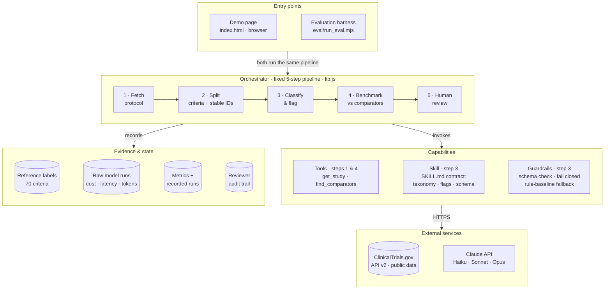

# Protocol Eligibility Copilot

**Live demo:** https://lorenzopolidori.github.io/protocol-eligibility-copilot/

A one-day prototype of an agentic-AI skill for clinical **Development Operations**. It takes a
protocol from ClinicalTrials.gov and turns its eligibility criteria into structured, reviewable
data. Each criterion gets a category, its thresholds and washout windows, and feasibility flags
for a reviewer. It then benchmarks the protocol against completed trials in the same indication
and phase. It is evaluated against a rule-based baseline on quality, cost, latency and
run-to-run consistency.

Uses only public registry data and makes no eligibility decision about any patient. Not affiliated with or endorsed by GSK.

## Background

**Clinical trials.** Before a new medicine or vaccine can be approved, a drug company (the
*sponsor*) tests it on volunteers in clinical trials. A Phase 3 trial is the large, final stage,
often with hundreds or thousands of participants at dozens of hospitals (*sites*) in many
countries. It usually takes years and costs a great deal.

**The protocol.** Each trial follows a written rulebook called the protocol. It covers what is
being tested, on whom, how and for how long. Sponsors publish a summary of every protocol on
[ClinicalTrials.gov](https://clinicaltrials.gov), the public US registry used worldwide. This
tool reads from it.

**Eligibility criteria.** One part of the protocol sets out who may take part. *Inclusion
criteria* are what a volunteer must have, and *exclusion criteria* are what rules them out. A
trial typically has 10 to 40 of them, written in dense medical language. Every
extra restriction shrinks the pool of patients who qualify. That slows recruitment, raises the
share of candidates who are screened and then turned away, and often forces costly protocol
changes (*amendments*) later.

**What the tool does to each criterion.** It turns one block of medical text into a structured
row that a person can scan, sort and question. Examples from GSK protocols in this demo:

| Criterion (from the protocol) | Category | Threshold | Washout / time window | Flag for the reviewer |
|---|---|---|---|---|
| "Body mass index (BMI) ≥16 kg/m²" | Demographics | BMI ≥ 16 | none | modernisation candidate |
| "Treatment with an HIV-1 immunotherapeutic vaccine within 90 days of screening" | Prior therapy | none | 90 days before screening | washout |
| "Known active infectious diseases … or known HIV" | Comorbidity & safety | none | none | ambiguous; modernisation candidate |
| "Participants who, in the opinion of the investigator, can and will comply with the protocol…" | Consent & logistics | none | none | investigator judgement |

- **Category:** what kind of rule it is, such as age or weight, the disease itself, past
  treatments, lab results, other illnesses, pregnancy, or consent. Grouping shows at a glance where
  a protocol is most restrictive.
- **Threshold:** the number that decides eligibility, such as a BMI of at least 16 or a lung
  function reading below 70%.
- **Washout window:** how long a volunteer must wait after a previous treatment before joining,
  such as 90 days. Long washouts delay or block enrolment.
- **Feasibility flags:** prompts for a human to look again. Examples: a rule that adds screening
  work, relies on a doctor's judgement, is worded ambiguously, or is the kind of exclusion that US
  regulators (FDA) and oncology groups now encourage sponsors to relax unless it is scientifically
  needed, such as blanket exclusion of people with HIV.

**Feasibility and the benchmark.** *Feasibility* asks whether a trial can realistically recruit
the patients it needs, on time and at the planned sites. To give context, the tool finds completed
trials of the same disease and phase on ClinicalTrials.gov and compares the protocol against their
typical (median) figures: number of criteria, participants, sites and duration. For example, the
depemokimab COPD trial plans 1,196 participants, against a median of about 330 in comparable
completed COPD Phase 3 trials. That gap is a useful question to ask early.

**The reviewer.** The output is a draft for a person on the study team, such as a feasibility or
clinical operations lead. They check every row, correct anything wrong, and every change is logged.
The tool never decides whether any patient is eligible, and it only uses public registry text.

**The goal.** Give study teams a fast, consistent first pass that challenges eligibility criteria
at the design stage, before sites see the protocol. That is the cheapest point to remove
unnecessary restrictions, and it should mean faster recruitment and fewer amendments. The wider aim
is to show a repeatable way to bring agentic AI into a regulated workflow:

1. Pick one real workflow.
2. Measure a simple baseline.
3. Build the AI step against a fixed contract.
4. Prove it beats the baseline on quality, cost, speed and consistency.
5. Keep a human accountable for every output.

**How we know it works.** Think of it as an exam with an answer key.

1. **The answer key.** Before any AI was run, each of the 70 criteria from the 5 protocols was
   given its correct category by hand. A few criteria genuinely fit two categories, and for
   those a second answer is also accepted.
2. **Two candidates take the exam:**
   - **The baseline:** a simple program that matches keywords. If it sees "vaccine" it answers
     *Prior therapy*; if it sees "history of" or "disease" it answers *Comorbidity*. It stands in
     for the quick tool a team might build first. It was written before the AI was tested and
     never adjusted to fit the answer key.
   - **The AI:** Claude, given the same criteria and the written category definitions.
3. **Marking.** Each answer is compared with the key.

Real examples where the two disagreed:

| Criterion (trial) | Answer key | Keyword baseline | Claude Sonnet |
|---|---|---|---|
| "History of hypersensitivity or allergic reaction to any previous influenza vaccine" (flu vaccine) | Comorbidity & safety: it is an allergy | ✗ Prior therapy, because it saw "vaccine" | ✓ Comorbidity & safety |
| "HIV-1 RNA <50 copies/mL at screening" (HIV treatment) | Disease: viral load measures the disease being studied | ✗ Comorbidity, because it saw "HIV" | ✓ Disease |
| "Moderate to severe COPD, defined as a clinically documented history of COPD…" (COPD) | Disease: it defines the condition under study | ✗ Comorbidity, because it saw "history of" | ✓ Disease |

The baseline matches words, while the AI reads context. For example, HIV is *the disease
under study* in an HIV trial but *another illness* in a lung cancer trial.

**The scores.**
- *Strict* counts only exact matches with the main answer: baseline 50 of 70 (71%), Claude
  Sonnet 65 of 70 (93%).
- *Lenient* also accepts the reasonable second answer: baseline 54 of 70 (77%), Sonnet 70 of 70
  (100%).
- All five of Sonnet's strict misses were criteria with two valid answers where it picked the
  other one. For example, "chronic hypercapnia requiring non-invasive ventilation" is *Disease*
  in the key, because it describes how severe the COPD is. Sonnet chose *Prior therapy*, because
  ventilation is a treatment. Both are defensible.

**Is it practical to use?** Accuracy is not enough on its own, so the report also measures:
- **Cost:** about $0.03 to process a whole protocol with Sonnet, at list price.
- **Speed:** about 9 seconds per protocol.
- **Consistency:** each protocol was run twice. Sonnet gave identical answers both times for all
  70 criteria; Haiku did for 96% and Opus for 99%. A reviewer should not get a different answer
  on Tuesday than on Monday.
- **Reliability:** every answer came back in the expected format. A malformed answer would be
  marked "needs review", never guessed.

**Bottom line.** The AI clearly beats the simple tool, and it is cheap and fast. But the answer
key is small and was drafted with AI help. The next steps are a larger key labelled by clinical
operations experts, and measuring how much reviewer time the tool actually saves.


## Architecture

A constrained workflow, not a free-roaming agent. Orchestration is deterministic, and the model is
called at one step against a fixed contract: a taxonomy, an output schema and stable criterion IDs.
The page and the evaluation harness share one core library, so what is evaluated is exactly what
runs.



| Block | Role | Agentic concern it addresses |
|---|---|---|
| Orchestrator | Runs fetch → split → classify → benchmark → review in a fixed order, with a fallback at every step | Orchestration, reliability |
| `get_study`, `find_comparators` | Deterministic tools over the public registry, testable like ordinary code | Tool use |
| Splitter + contract | One protocol per call, stable IDs, taxonomy definitions in the prompt, no patient data | Context |
| Schema check | Malformed or missing output becomes `NEEDS_REVIEW`, never a silent default | Reliability |
| Stateless calls, audit trail | Nothing carries between protocols; the only durable state is the reviewer log and the frozen snapshot | Memory |
| Eval harness + scorer | Baseline vs models on accuracy, cost, latency and run-to-run agreement; one command to re-run | Evaluation |
| `SKILL.md` | The step packaged as a reusable skill with its standards | Skills library |

## Flow of one run


## Results (5 GSK/ViiV Phase 3 protocols, 70 criteria, 2 runs per model, low effort)

| Method | Accuracy (lenient) | Accuracy (strict) | Cost / protocol* | Time / protocol | Run agreement |
|---|---|---|---|---|---|
| Rule baseline (keywords) | 77.1% | 71.4% | $0 | <1 ms | n/a |
| Claude Haiku 4.5 | 100% | 92.1% | $0.041 | 62.9 s | 95.7% |
| **Claude Sonnet 5.5** | **100%** | **92.9%** | **$0.027** | **8.6 s** | **100%** |
| Claude Opus 5.5 | 100% | 93.6% | $0.052 | 11.8 s | 98.6% |

\* List price through headless Claude Code's harness, so an upper bound on a direct API call.
Lenient accuracy accepts a second defensible label for compound criteria; strict uses the
primary label only. The category task saturates, so the decision comes down to cost, latency and
consistency. The next evaluation round should score the flags and thresholds against labels from
clinical operations reviewers.

## Layout

```
index.html                 the demo page (static; no build step)
lib.js                     splitter, rule baseline, taxonomy, prompt, scorer, CT.gov tools
                           (shared by the page and the eval harness, so they cannot drift)
data/results.js            evaluation output consumed by the page
skills/eligibility-criteria-structurer/SKILL.md   the step packaged as a reusable agent skill
eval/run_eval.mjs          evaluation harness (baseline vs Claude models)
eval/gold_labels.json      reference labels (pilot set; see caveats)
eval/data/*.json           frozen ClinicalTrials.gov records used for evaluation
eval/runs/*.json           raw model outputs with cost, latency and token usage
```

## Re-run the evaluation

Requires Node 18+ and the `claude` CLI (Claude Code) signed in.

```
node eval/run_eval.mjs --models haiku,sonnet,opus --repeats 2 --effort low
```

Cached runs in `eval/runs/` are reused; pass `--refresh` to re-fetch the protocols and re-call
the models.

## Live mode

On GitHub Pages the page fetches any NCT ID live from the ClinicalTrials.gov API v2. With
"Claude Sonnet 5.5 · live" selected and an Anthropic API key entered, it calls the Messages API
directly from your browser. The key stays in page memory and is never stored or sent anywhere
else.

## Caveats

- 70 criteria is a pilot set. The reference labels were drafted with AI assistance against the
  written taxonomy, with the author's review in progress. AI-assisted labels can favour
  model-style labelling.
- The feasibility flags and thresholds are shown but not yet scored.
- Comparator benchmarks use the top 50 registry matches by relevance. Registry criteria are
  often abridged versions of the full protocol.
- Manual review time has not been measured. A time-and-motion baseline with a study team comes
  before any cycle-time claim.
