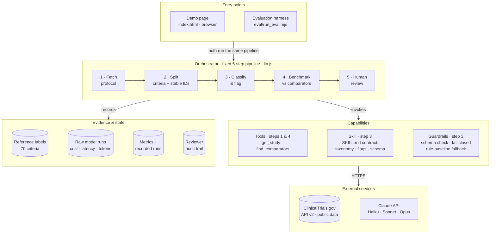
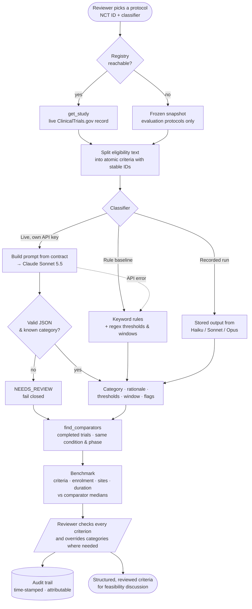

# Protocol Eligibility Copilot

**Live demo:** https://lorenzopolidori.github.io/protocol-eligibility-copilot/

A one-day prototype of an agentic-AI skill for clinical **Development Operations**. It takes a
protocol from ClinicalTrials.gov and turns its eligibility criteria into structured, reviewable
data. Each criterion gets a category, its thresholds and washout windows, and feasibility flags
for a reviewer. It then benchmarks the protocol against completed trials in the same indication
and phase. It is evaluated against a rule-based baseline on quality, cost, latency and
run-to-run consistency.

Built by Lorenzo Polidori with Claude Code. Uses only public registry data and makes no
eligibility decision about any patient. Not affiliated with or endorsed by GSK.

## Architecture

A constrained workflow, not a free-roaming agent. Orchestration is deterministic, and the model is
called at one step against a fixed contract: a taxonomy, an output schema and stable criterion IDs.
The page and the evaluation harness share one core library, so what is evaluated is exactly what
runs.



| Block | Role | Agentic concern it addresses |
|---|---|---|
| Orchestrator | Runs fetch → split → classify → benchmark → review in a fixed order, with a fallback at every step | Orchestration, reliability |
| `get_study`, `find_comparators` | Deterministic tools over the public registry, testable like ordinary code | Tool use |
| Splitter + contract | One protocol per call, stable IDs, taxonomy definitions in the prompt, no patient data | Context |
| Schema check | Malformed or missing output becomes `NEEDS_REVIEW`, never a silent default | Reliability |
| Stateless calls, audit trail | Nothing carries between protocols; the only durable state is the reviewer log and the frozen snapshot | Memory |
| Eval harness + scorer | Baseline vs models on accuracy, cost, latency and run-to-run agreement; one command to re-run | Evaluation |
| `SKILL.md` | The step packaged as a reusable skill with its standards | Skills library |

## Flow of one run



## Results (5 GSK/ViiV Phase 3 protocols, 70 criteria, 2 runs per model, low effort)

| Method | Accuracy (lenient) | Accuracy (strict) | Cost / protocol* | Time / protocol | Run agreement |
|---|---|---|---|---|---|
| Rule baseline (keywords) | 77.1% | 71.4% | $0 | <1 ms | n/a |
| Claude Haiku 4.5 | 100% | 92.1% | $0.041 | 62.9 s | 95.7% |
| **Claude Sonnet 5.5** | **100%** | **92.9%** | **$0.027** | **8.6 s** | **100%** |
| Claude Opus 5.5 | 100% | 93.6% | $0.052 | 11.8 s | 98.6% |

\* List price through headless Claude Code's harness, so an upper bound on a direct API call.
Lenient accuracy accepts a second defensible label for compound criteria; strict uses the
primary label only. The category task saturates, so the decision comes down to cost, latency and
consistency. The next evaluation round should score the flags and thresholds against labels from
clinical operations reviewers.

## Layout

```
index.html                 the demo page (static; no build step)
lib.js                     splitter, rule baseline, taxonomy, prompt, scorer, CT.gov tools
                           (shared by the page and the eval harness, so they cannot drift)
data/results.js            evaluation output consumed by the page
skills/eligibility-criteria-structurer/SKILL.md   the step packaged as a reusable agent skill
eval/run_eval.mjs          evaluation harness (baseline vs Claude models)
eval/gold_labels.json      reference labels (pilot set; see caveats)
eval/data/*.json           frozen ClinicalTrials.gov records used for evaluation
eval/runs/*.json           raw model outputs with cost, latency and token usage
```

## Re-run the evaluation

Requires Node 18+ and the `claude` CLI (Claude Code) signed in.

```
node eval/run_eval.mjs --models haiku,sonnet,opus --repeats 2 --effort low
```

Cached runs in `eval/runs/` are reused; pass `--refresh` to re-fetch the protocols and re-call
the models.

## Live mode

On GitHub Pages the page fetches any NCT ID live from the ClinicalTrials.gov API v2. With
"Claude Sonnet 5.5 · live" selected and an Anthropic API key entered, it calls the Messages API
directly from your browser. The key stays in page memory and is never stored or sent anywhere
else.

## Caveats

- 70 criteria is a pilot set. The reference labels were drafted with AI assistance against the
  written taxonomy, with the author's review in progress. AI-assisted labels can favour
  model-style labelling.
- The feasibility flags and thresholds are shown but not yet scored.
- Comparator benchmarks use the top 50 registry matches by relevance. Registry criteria are
  often abridged versions of the full protocol.
- Manual review time has not been measured. A time-and-motion baseline with a study team comes
  before any cycle-time claim.
